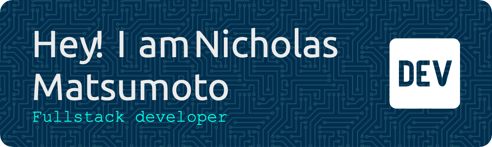

<h1 align="center">Hi 👋, I'm Nick </h1>

<h3 align="center">Connect with me:</h3>

  

<h4 align="left">I’m a full-stack developer with over 10 years of IT infrastructure experience and a passion for building scalable applications. After several years teaching in Japan, I transitioned into software development and completed the Le Wagon bootcamp in Tokyo. I’m now focused on developing projects that combine my love for technology, fitness, and entrepreneurship—like my goal of creating a calisthenics training app.

Feel free to check out my projects and get in touch!</h4>

**<h3 align="left">Rapid Fire</h3>**

- 💼 I'm currently working on: **[Form - a calisthenics app that tracks your form through video](www.form-calisthenics.com)**
- 🌱 I'm currently learning: **Testing, Flutter, React and AWS**

 **<h3 align="left">Skills</h3>**

              

 **<h3 align="left">GitHub Stats</h3>**

  

